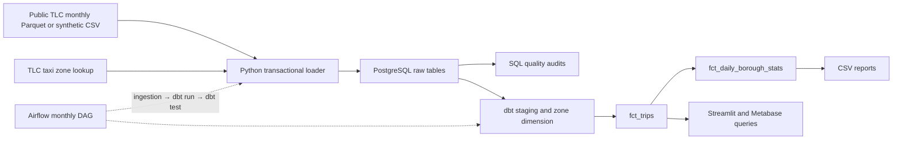

# NYC Taxi Analytics Pipeline

A reproducible green-taxi analytics project: monthly ingestion into PostgreSQL, SQL quality audits, tested dbt marts, Streamlit reporting and Airflow orchestration.

**Business questions:** How does trip volume vary by borough and hour? How do distance and fare per mile differ by payment type? Can a month be reloaded without duplicating rows or losing another month's data?

Built from my completed HackYourFuture Data Track Weeks 9–12 solutions. This repository integrates and adapts those assignments into one runnable project; the original repositories remain available. [Source branches and changes](docs/provenance.md).

## Data flow



**Stack:** Python · PostgreSQL · SQL · dbt · Streamlit · Airflow 3 · Docker · GitHub Actions

## Try the sample

Requires Docker Desktop with Linux containers and Docker Compose. Run from the repository root:

```sh
docker compose up -d --wait postgres
docker compose build pipeline
docker compose run --rm pipeline python -m taxi_pipeline.ingest --source sample
docker compose run --rm pipeline dbt build --project-dir dbt --profiles-dir dbt
docker compose run --rm pipeline python -m taxi_pipeline.report
```

The synthetic fixture covers January and February 2024 and deliberately includes quality issues. It requires no HYF database, Azure account or API key. Package/image installation needs internet access on the first run.

| Sample result | Expected value |
|---|---:|
| Raw records | 12 |
| Accepted trip records | 8 |
| Total fare | $87.00 |
| Mean trip distance | 2.125 miles |
| Mean fare per mile | $5.285714… |
| Cash / credit-card records | 3 / 5 |

These are fixture results, **not measured NYC demand**. [Saved output CSVs](reports/sample/) make the result inspectable without installing anything. [Metric definitions](docs/metrics.md) explain populations and denominators.

### Dashboard

After building the sample marts:

```sh
docker compose --profile dashboard up -d dashboard
```

Open [localhost:8503](http://localhost:8503). The dashboard has payment filters, three KPIs, a 24-hour demand chart, borough totals and data coverage. It labels whether its records are synthetic or public TLC data.

### Public TLC month

The same loader accepts the official monthly green-taxi files and taxi zone lookup:

```sh
docker compose run --rm pipeline python -m taxi_pipeline.ingest --source tlc --month 2024-01
docker compose run --rm pipeline dbt build --project-dir dbt --profiles-dir dbt
docker compose run --rm pipeline python -m taxi_pipeline.report
```

Loading a public month replaces that month in the current raw schema. The sample's February rows remain until February is separately replaced. Use a separate raw/mart schema for a fully separate dataset; [runbook](docs/runbook.md). The dashboard's dataset label identifies mixed source populations.

[NYC TLC trip record data](https://www.nyc.gov/site/tlc/about/tlc-trip-record-data.page) · [Green-taxi field dictionary](https://www.nyc.gov/assets/tlc/downloads/pdf/data_dictionary_trip_records_green.pdf)

An independently run January 2024 Docker load produced **56,549 raw records → 56,367 accepted records**, passing all 14 dbt checks. [Saved public aggregate outputs and interpretation limits](reports/public-january-2024/).

## Orchestration

The Airflow DAG runs `ingest_taxi_month → dbt_run → dbt_test`, with two retries and one active run. It starts paused; sample runs require an explicit `source: sample` override. Scheduled runs use public TLC files for their monthly data interval. Recent files may not yet be published, so this is a historical-month demonstration rather than a guaranteed current-month feed.

```sh
docker compose build airflow
docker compose run --rm airflow python /opt/taxi/test_dag.py
docker compose run --rm airflow python /opt/taxi/run_sample_dag.py
```

[Airflow setup and manual runs](docs/runbook.md#airflow). Metabase is optional: [portable SQL questions](dashboards/metabase/questions.sql) can be recreated in an existing installation; the core run does not need Metabase.

## Verification

The project includes 14 Python checks and 14 dbt data checks. They cover month boundaries, safe schema names, repeat loads, transactional rollback, dashboard payment filtering, key uniqueness, daily grain and reconciliation between trip and daily marts. Python database/dashboard checks require the sample marts and `POSTGRES_TEST_URL`; without it they skip explicitly.

```sh
uv sync --frozen --python 3.12
uv run ruff check taxi_pipeline dashboards tests orchestration
uv run ruff format --check taxi_pipeline dashboards tests orchestration
```

For all Python checks, see the [PowerShell and shell test commands](docs/runbook.md#python-checks). [Validation scope](docs/validation.md) separates tested behavior from historical coursework evidence and deployment claims.

## Design notes

- Each month is replaced in one database transaction; empty input is refused before deletion. Other months are preserved, and loaders sharing a raw schema serialize through an advisory lock.
- The trip ID locates a row in a monthly source file. TLC does not provide a guaranteed physical-trip primary key here; duplicate-looking records are audited, not silently removed.
- The trip mart drops missing/unknown pickup locations, negative or missing fares and negative or missing distances. Unknown dropoffs remain as `Unknown`. Zero denominators produce NULL ratios.
- TLC cash tips are not recorded. Mean tip percentage is therefore not a complete comparison of passenger tipping behavior.
- Full dbt table rebuilds keep the local project simple. Large datasets would need partitioning, incremental rebuilds and stronger observability.

## Project guide

| Area | Contents |
|---|---|
| [taxi_pipeline](taxi_pipeline/) | Ingestion, connection settings and report exports |
| [sql](sql/) | Raw-data audits and reconciliation queries |
| [dbt](dbt/) | Staging views, dimension, trip mart and daily mart |
| [dashboards](dashboards/) | Streamlit app and Metabase questions |
| [orchestration](orchestration/) | Airflow DAG and isolated runtime |
| [Architecture](docs/architecture.md) | Contracts, transactions and model dependencies |
| [Data dictionary](docs/data-dictionary.md) | Source fields, output grains and keys |
| [Data quality](docs/data-quality.md) | Exclusions and fixture audit results |
| [Runbook](docs/runbook.md) | Public loads, tests and local operations |
| [Provenance](docs/provenance.md) | Original HYF solution branches and integration changes |

Author: [Mohammed Alfakih](https://github.com/mohammedalfakih-dev). Developed through the [HackYourFuture](https://www.hackyourfuture.net/) Data Track, using its assignment scaffolds. Public trip and zone data: NYC Taxi & Limousine Commission.
