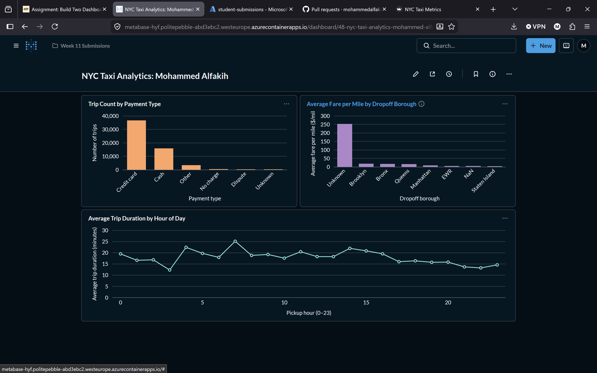

# Metabase questions

The [SQL questions](questions.sql) recreate the coursework panels against this repository's trip mart:

1. Record counts by payment label.
2. Mean fare per mile by dropoff borough.
3. Mean trip duration by pickup hour.

Connect an existing Metabase installation to the local PostgreSQL database and create each as a SQL question. Use the host port `15432` from outside Docker; inside this Compose network the database is `postgres:5432`. The default schema is `taxi_analytics`; update it if using a separate public mart.

This is a historical screenshot from the completed Week 11 solution, using the class dataset. It is not a screenshot of the new fixture or a currently hosted public dashboard. Metabase hosting and visual recreation are optional and are not part of the core automated checks.
